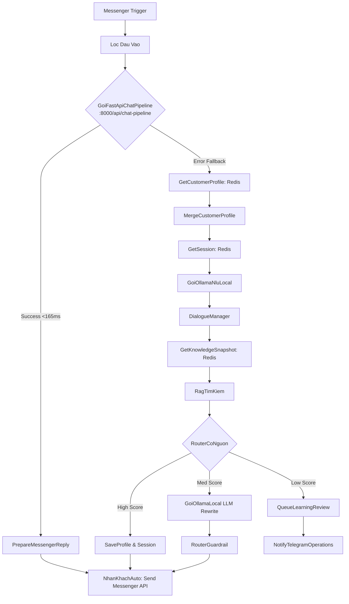
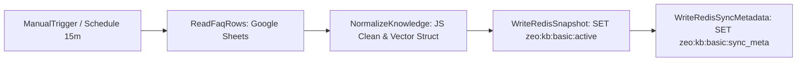
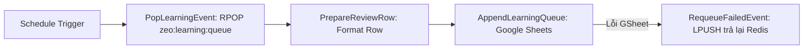
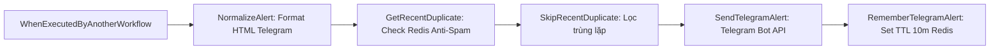

# Tài Liệu Kiến Trúc & Luồng Hoạt Động Của 7 Workflows n8n

> Hệ thống Chatbot đa thương hiệu **ZeO Vietnam** (Chăm sóc nhà cửa) & **CFC Cò Bay** (Phân bón nông nghiệp) kết hợp giữa **n8n Automation Engine** và **FastAPI High-Performance Fast-Path Pipeline**.

---

## 🗺️ Tổng Quan 7 Workflows

```
┌──────────────────────────────────────────────────────────────────────────────────────────┐
│                                   CÁC NHÓM WORKFLOW                                      │
├───────────────────────────────┬───────────────────────────────┬──────────────────────────┤
│ 1. NHÓM CHATBOT THỜI GIAN THỰC│ 2. NHÓM ĐỒNG BỘ KIẾN THỨC     │ 3. NHÓM VẬN HÀNH & BÁO CÁO│
├───────────────────────────────┼───────────────────────────────┼──────────────────────────┤
│ ① Zeo Chatbot                 │ ③ Zeo Knowledge Sync          │ ⑤ Zeo Learning Queue Exp │
│ ② CFC Co Bay Chatbot          │ ④ CFC Co Bay Knowledge Sync   │ ⑥ CFC Learning Queue Exp │
│                               │                               │ ⑦ Chatbot Operations Alert│
└───────────────────────────────┴───────────────────────────────┴──────────────────────────┘
```

---

## 1. Workflow ①: `Zeo Chatbot` (ID: `d7fctbMhVUmhrNG0`)
*Vận hành nhận tin nhắn từ Facebook Page ZeO Vietnam, phản hồi khách hàng trong <180ms.*

### Luồng xử lý (Flowchart):


### Chi tiết các bước:
1. **Messenger Trigger**: Nhận webhook realtime `POST` từ Facebook Graph API khi người dùng gửi tin nhắn đến Page ZeO.
2. **Lọc Đầu Vào (`LocDauVao`)**: Chuẩn hóa payload, loại bỏ message echo (tin nhắn bot tự gửi), xử lý text tiếng Việt (có dấu / không dấu).
3. **Fast-Path Pipeline (`GoiFastApiChatPipeline`)** *(Kiến trúc mới)*:
   - Gọi `POST http://localhost:8000/api/chat-pipeline` với `brand: "zeo"`.
   - Python pipeline thực hiện: Regex Phone Extraction + RediSearch Vector KNN + Shopee Match + Lưu Session Redis chạy nền.
   - Trả lời trực tiếp chỉ mất **~165ms**.
4. **Chuẩn bị phản hồi (`PrepareMessengerReply`)**: Format payload chuẩn Facebook Send API.
5. **Gửi tin nhắn (`NhanKhachAuto`)**: Gọi Facebook Graph API gửi tin nhắn lại cho khách hàng.
6. **Mạch bảo vệ Fallback (Infallible Fallback)**:
   - Nếu FastAPI server bận/lỗi, link `.error()` tự động kích hoạt chuyển sang luồng n8n thuần (Ollama + RediSearch Snapshot + Guardrail kiểm tra an toàn + bắn Telegram Admin).

---

## 2. Workflow ②: `CFC Co Bay Chatbot` (ID: `uJOo6NQO2mJZhUAr`)
*Vận hành nhận tin nhắn từ Facebook Page Phân Bón Cò Bay CFC, tư vấn cây trồng & phân bón nông nghiệp.*

### Luồng xử lý:
- Tương tự như Zeo Chatbot nhưng chạy với cấu hình ngữ cảnh nông nghiệp của **CFC Cò Bay**:
  - Nhận diện các intent: Báo giá sỉ đại lý (`wholesale_inquiry`), hướng dẫn bón phân theo mùa vụ lúa/cây ăn trái, tìm đại lý gần nhất.
  - Phân loại Lead: Tự động trích xuất Tên, SĐT, Tỉnh/Thành khu vực (Kiên Giang, An Giang, Cần Thơ...) đưa vào Lead Pipeline.
  - Tự động gắn tag `lead_ready`, `wholesale` và chuyển tiếp điều phối viên qua Telegram khi có khách đại lý.

---

## 3. Workflow ③: `Zeo Knowledge Sync` (ID: `DhrLUsDsldhxtTdX`)
*Đồng bộ dữ liệu FAQ từ Google Sheets của ZeO về Redis Key Active.*

### Luồng xử lý:


### Chi tiết các bước:
1. **Trigger**: Kích hoạt định kỳ (Cron mỗi 15 phút hoặc khi Admin bấm nút Sync trên Dashboard).
2. **ReadFaqRows**: Đọc toàn bộ hàng từ Google Sheets FAQ của ZeO (Câu hỏi mẫu, câu trả lời, Intent, Category, Keywords).
3. **NormalizeKnowledge**: Chuẩn hóa tiếng Việt, loại bỏ khoảng trắng, format cấu trúc JSON.
4. **WriteRedisSnapshot**: Ghi đè snapshot toàn bộ kiến thức vào Redis key `zeo:kb:basic:active`.
5. **WriteRedisSyncMetadata**: Lưu thời gian đồng bộ, số lượng FAQ, checksum vào `zeo:kb:basic:sync_meta`.

---

## 4. Workflow ④: `CFC Co Bay Knowledge Sync` (ID: `92I5floRW5MElgu5`)
*Đồng bộ dữ liệu FAQ và kỹ thuật canh tác từ Google Sheets CFC về Redis.*

### Luồng xử lý:
- Đọc Google Sheet FAQ phân bón CFC Cò Bay.
- Chuẩn hóa các thuật ngữ chuyên ngành nông nghiệp (NPK, trung vi lượng, lúa sạ, bón đón đòng...).
- Ghi snapshot vào Redis key `cfc:kb:basic:active` và cập nhật `cfc:kb:basic:sync_meta`.

---

## 5. Workflow ⑤: `Zeo Learning Queue Export` (ID: `sUgJYuP1hj75sERu`)
*Tự động lấy câu hỏi bot không tự tin từ Redis đẩy lên Google Sheets để chuyên viên kiểm duyệt.*

### Luồng xử lý:


### Chi tiết các bước:
1. **Trigger**: Chạy định kỳ mỗi 30 phút.
2. **PopLearningEvent**: Lấy event chưa duyệt ra khỏi Redis Queue `zeo:learning:queue`.
3. **PrepareReviewRow**: Định dạng cột: Thời gian | User ID | Câu hỏi của khách | Độ tin cậy (Score) | Bot trả lời tạm | Trạng thái (Pending).
4. **AppendLearningQueue**: Ghi thêm dòng mới vào tab `Learning Queue` trên Google Sheets.
5. **RequeueFailedEvent**: Nếu ghi Google Sheets thất bại (mất mạng/hết quota), tự động đẩy ngược lại vào Redis queue để không bao giờ bị mất dữ liệu.

---

## 6. Workflow ⑥: `CFC Learning Queue Export` (ID: `hPY4cMva4TOCOXee`)
*Tự động xuất Learning Queue cho phân bón CFC Cò Bay.*

### Luồng xử lý:
- Tương tự như Zeo Learning Queue Export nhưng thao tác trên hàng đợi `cfc:learning:queue` và ghi vào Google Sheets quản trị của CFC Cò Bay.

---

## 7. Workflow ⑦: `Chatbot Operations Alert` (ID: `f2IjxVj9sW3KQRAw`)
*Sub-workflow cảnh báo tức thì qua Telegram khi có khách sỉ / Lead nóng hoặc câu hỏi cần người thật hỗ trợ.*

### Luồng xử lý:


### Chi tiết các bước:
1. **Trigger**: Được gọi trực tiếp từ Workflow ① và ② (`executeWorkflow`) khi phát hiện:
   - Khách để lại Số Điện Thoại.
   - Khách hỏi mua sỉ / mở đại lý phân bón.
   - Khách yêu cầu gặp tư vấn viên trực tiếp.
2. **NormalizeAlert**: Tạo tin nhắn Telegram định dạng đẹp với icon, thương hiệu, tên khách, SĐT và nội dung câu hỏi.
3. **Chống Spam (`GetRecentDuplicate` & `SkipRecentDuplicate`)**:
   - Kiểm tra Redis xem tin nhắn từ `senderId` này đã gửi trong vòng 10 phút chưa.
   - Nếu đã gửi gần đây → Bỏ qua để tránh spam nhóm Telegram.
4. **SendTelegramAlert**: Bắn thông báo trực tiếp vào nhóm Telegram Quản lý / Sale.
5. **RememberTelegramAlert**: Lưu mã vết vào Redis với thời gian sống (TTL) 10 phút.
