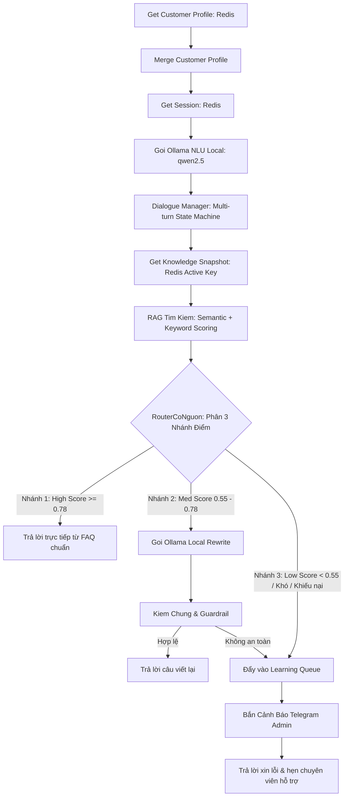

# TÀI LIỆU CHI TIẾT KIẾN TRÚC & LUỒNG HOẠT ĐỘNG 2 WORKFLOW CHATBOT
## ZeO Chatbot & CFC Cò Bay Chatbot

> **Hệ thống Chatbot AI Đa Thương Hiệu Đa Tầng (Dual-Path High-Performance Architecture)**  
> *Phiên bản: 2.2 — Cập nhật: 15/08/2026*

---

## 🗺️ TỔNG QUAN KIẾN TRÚC 2 TẦNG (DUAL-PATH ARCHITECTURE)

Hệ thống chatbot cho cả hai thương hiệu **ZeO Vietnam** (ID: `d7fctbMhVUmhrNG0`) và **CFC Cò Bay** (ID: `uJOo6NQO2mJZhUAr`) được thiết kế theo kiến trúc **2 Tầng kết hợp (Fast-Path + Deep Fallback)**:

```
                  ┌──────────────────────────────────────────────────┐
                  │          Facebook Messenger Webhook              │
                  └─────────────────────────┬────────────────────────┘
                                            │
                                            ▼
                  ┌──────────────────────────────────────────────────┐
                  │              Node: Lọc Đầu Vào                   │
                  │   - Chuẩn hóa tiếng Việt, từ lóng, viết tắt      │
                  │   - Regex bóc tách SĐT & Khu vực Tỉnh/Thành      │
                  │   - Phát hiện sớm: Chào, Cảm ơn, Chửi bot, Sỉ   │
                  └─────────────────────────┬────────────────────────┘
                                            │
                  ┌─────────────────────────┴────────────────────────┐
                  │                                                  │
                  ▼ (Đường ưu tiên - Fast Path)                      ▼ (Đường Fallback dự phòng)
 ┌──────────────────────────────────────────────┐   ┌──────────────────────────────────────────────┐
 │  Node: Gọi FastAPI Chat Pipeline (:8000)     │   │  TẦNG DỰ PHÒNG N8N THUẦN (KHI FASTAPI BẬN)  │
 │  - RediSearch Vector KNN (HNSW bge-m3)       │   │  1. Get Profile & Session (Redis)            │
 │  - Khớp link Shopee Catalog                  │   │  2. Gọi Ollama NLU (qwen2.5:7b)              │
 │  - Trích xuất SĐT & Lưu Session ngầm         │   │  3. Dialogue Manager (Quản lý đa vòng)       │
 │  - Tốc độ: ~165ms                            │   │  4. RAG Snapshot Search (zeo/cfc:kb:active)  │
 └──────────────────────┬───────────────────────┘   └──────────────────────┬───────────────────────┘
                        │                                                  │
                        ├──────────────────◄───────────────────────────────┘
                        │
                        ▼
 ┌──────────────────────────────────────────────┐
 │     Node: Prepare Messenger Reply            │
 └──────────────────────┬───────────────────────┘
                        │
                        ▼
 ┌──────────────────────────────────────────────┐
 │  Node: Gửi Tin Nhắn Facebook (Send API)      │
 └──────────────────────────────────────────────┘
```

---

## 📍 HÀNH TRÌNH CHI TIẾT CỦA MỘT TIN NHẮN (STEP-BY-STEP)

---

### BƯỚC 1: TIẾP NHẬN TIN NHẮN (Messenger Trigger)
- **Node**: `Messenger Trigger` (`facebookTrigger`)
- **Nhiệm vụ**: Nhận tín hiệu Webhook tức thì từ Facebook Graph API khi người dùng gửi tin nhắn đến Fanpage.
- **Dữ liệu thô**: `sender.id`, `message.text`, `message.mid`, `attachments`, `is_echo`.

---

### BƯỚC 2: LỌC ĐẦU VÀO & BÓC TÁCH NGỮ NGHĨA SỚM (Lọc Đầu Vào)
- **Node**: `Loc Dau Vao` (`code`)
- **Nhiệm vụ xử lý**:
  1. **Chặn tin nhắn lặp (Echo Suppression)**: Nếu `is_echo = true` (tin nhắn do chính bot hoặc page gửi đi), bỏ qua ngay lập tức để không lặp vô tận.
  2. **Chuẩn hóa chữ tiếng Việt & viết tắt (`normalizeForSearch`)**:
     - Mở rộng từ viết tắt: `k, ko, kh, hok, hem` → `khong`; `sp` → `san pham`; `sdt, dt` → `so dien thoai`; `ib, nt` → `nhan tin`; `dc, dk` → `duoc`.
     - Xóa dấu phụ, chuyển về chữ thường để so khớp chuẩn.
  3. **Trích xuất Số Điện Thoại (Regex VN)**:
     - Quét mẫu: `/(?:\+84|84|0)(?:3[2-9]|5[2689]|7[06789]|8[0-9]|9[0-9])[0-9]{7}\b/`.
     - Đảm bảo bóc chính xác số điện thoại mà không nuốt số nhà/địa chỉ.
  4. **Nhận diện Khu Vực / Tỉnh Thành**:
     - Quét từ khóa: `Cần Thơ, Kiên Giang, Rạch Giá, Long An, Đồng Nai, Bình Dương, HCM...`
  5. **Phân loại intent sớm**:
     - `isGreeting`: Chào hỏi ngắn (`chào shop, hello, hi, alo...`).
     - `isThanks`: Cảm ơn (`cảm ơn shop, thanks...`).
     - `isGoodbye`: Tạm biệt (`tạm biệt, bye, hẹn gặp lại...`).
     - `isBotComplaint`: Khách chê bot / khiếu nại bot trả lời sai (`bot ngu, trả lời kỳ vậy, không đúng...`).
     - `isSensitive`: Khiếu nại, lừa đảo, hàng giả, đổi trả.
     - `isOutOfScope`: Hỏi sai thương hiệu (hỏi phân bón bên page ZeO hoặc ngược lại).
     - `hasOrderQuantity`: Khách đặt số lượng cụ thể (`cho 2 can 3.6kg`, `mua 5 bao 25kg`...).

---

### BƯỚC 3: TẦNG TỐC ĐỘ CAO (FAST-PATH PIPELINE)
- **Node**: `Goi Fast API Chat Pipeline` (`httpRequest`)
- **Đường dẫn**: `POST http://127.0.0.1:8000/api/chat-pipeline`
- **Nhiệm vụ thực thi trong ~165ms**:
  1. Đọc Session và Profile khách hàng từ Redis Stack.
  2. Tạo Vector Embedding câu hỏi bằng mô hình `bge-m3` qua Ollama.
  3. Thực hiện **RediSearch Vector Search (KNN = 5)** trên Index (`zeo:vec:faq` hoặc `cfc:vec:faq`).
  4. Quét từ khóa Shopee Catalog: Nếu phát hiện câu hỏi về sản phẩm, tự động ghép link Shopee Mall chính hãng vào câu trả lời.
  5. Tự động lưu vết Session và Profile (SĐT, Lead Stage) vào Redis ở chế độ Background Task (không làm chậm tốc độ phản hồi).

---

### BƯỚC 4: KHI NỘI DUNG PHỨC TẠP HOẶC GẶP LỖI (DEEP FALLBACK PATH)

> Nếu Fast-Path HTTP Request gặp sự cố (Timeout > 8s, server reload...), link lỗi `onError: continueErrorOutput` sẽ tự động kích hoạt **Tầng Dự Phòng n8n thuần**.



#### 4.1. Lấy Hồ Sơ & Session (`GetCustomerProfile`, `GetSession`)
- Lấy profile khách hàng: `zeo:customer:messenger:{senderId}`
- Lấy session chat gần nhất: `zeo:session:messenger:{senderId}`

#### 4.2. Phân Tích Ý Định Bằng LLM Local (`GoiOllamaNluLocal`)
- Sử dụng mô hình `qwen2.5:7b-instruct` chạy trực tiếp trên máy với prompt chuẩn hóa:
  - Phân loại: `intent`, `sentiment`, `order_items`, `needs_human`, `use_rag`.

#### 4.3. Quản Lý Hội Thoại Đa Vòng (`DialogueManager`)
- Xử lý slot-filling: Nếu khách vừa để lại SĐT sau khi bot xin thông tin → Nhận diện `contact_information_received`.
- Xử lý chửi bot (`isBotComplaint`): Chuyển ngay sang chế độ xin lỗi chân thành (`repair_wrong_answer`) và tắt RAG để tránh cãi nhau với khách.
- Xử lý chào hỏi / cảm ơn: Phản hồi ngay mà không cần tốn tài nguyên RAG.

#### 4.4. Tra Cứu Tri Thức Snapshot (`GetKnowledgeSnapshot` & `RagTimKiem`)
- Đọc snapshot kiến thức đang active: `zeo:kb:basic:active` (hoặc `cfc:kb:basic:active`).
- Tính điểm tương đồng ngữ nghĩa + từ khóa + trọng số danh mục.

#### 4.5. Phân Nhánh Điểm Số (`RouterCoNguon`):
1. **🟢 Nhánh Điểm Cao (`score ≥ 0.78`)**:
   - Câu hỏi khớp chính xác với FAQ.
   - Trả lời ngay câu trả lời chuẩn đã duyệt.
2. **🟡 Nhánh Điểm Trung Bình (`0.55 ≤ score < 0.78`)**:
   - Câu hỏi có liên quan nhưng cần viết lại cho mềm mại.
   - Gửi sang `GoiOllamaLocal` để viết lại câu trả lời theo văn phong chăm sóc khách hàng.
   - Đi qua `KiemChung` (Guardrail): Kiểm tra xem bot có bịa đặt thông tin, nói sai giá, hoặc lộ prompt hay không.
     - **Đạt chuẩn**: Trả lời câu văn viết lại.
     - **Không đạt**: Tự động chuyển xuống Nhánh 3 an toàn.
3. **🔴 Nhánh Điểm Thấp (`score < 0.55`) / Khiếu Nại / Ngoài Phạm Vi / Khách Khó Tính**:
   - Bot không tự tiện bịa câu trả lời.
   - Đưa câu hỏi vào hàng đợi học hỏi `QueueLearningReview` (`zeo:learning:queue`).
   - Kích hoạt Sub-workflow `Chatbot Operations Alert` để bắn tin nhắn Telegram cho Admin/Sale trực fanpage.
   - Trả lời mẫu lịch sự an toàn:  
     *“Dạ ZeO/CFC đã ghi nhận câu hỏi của bạn và đang chuyển cho chuyên viên tư vấn hỗ trợ mình ngay nhé ạ!”*

---

### BƯỚC 5: LƯU TRỮ TRẠNG THÁI & GỬI TIN NHẮN CHO KHÁCH
- **`SaveCustomerProfile`**: Cập nhật SĐT mới, khu vực, Lead Stage (`new` → `lead_ready` → `qualified`).
- **`SaveSession`**: Lưu tin nhắn vừa gửi để làm ngữ cảnh cho câu hỏi tiếp theo (TTL 24 giờ).
- **`NhanKhachAuto`**: Gọi Facebook Graph API (Send Message Endpoint) gửi tin nhắn đến hộp thư Messenger của khách hàng.

---

## ⚖️ ĐIỂM KHÁC BIỆT GIỮA 2 WORKFLOW CHATBOT

| Đặc tính | ① ZeO Chatbot | ② CFC Cò Bay Chatbot |
|---|---|---|
| **Lĩnh vực** | Hóa mỹ phẩm, nước giặt, tẩy rửa gia dụng | Phân bón NPK, hữu cơ, dinh dưỡng cây trồng |
| **Thương hiệu** | ZeO Vietnam, Pano, Oplus | Phân Bón Cò Bay, CFC Cần Thơ |
| **Tích hợp TMĐT** | Tự động chèn link Shopee Mall chính hãng | Điều hướng mua sỉ, tìm đại lý theo tỉnh thành |
| **Xử lý Lead** | Chốt đơn lẻ, tư vấn giặt tẩy, đại lý sỉ | Thu thập diện tích canh tác (ha/công), loại cây, tỉnh |
| **Index Vector** | `zeo:vec:faq` (1024 dims) | `cfc:vec:faq` (1024 dims) |
| **Queue Review** | `zeo:learning:queue` | `cfc:learning:queue` |

---

## 🛡️ MA TRẬN BẢO VỆ & AN TOÀN HỆ THỐNG (GUARDRAILS)

1. **Chống lặp tin nhắn (Loop Protection)**: Loại bỏ toàn bộ `is_echo` từ Facebook webhook.
2. **Chống Spam Telegram (Alert Anti-Spam)**: Giới hạn mỗi khách hàng chỉ gửi cảnh báo Telegram tối đa 1 lần mỗi 10 phút.
3. **Không bao giờ mất dữ liệu (Zero Data Loss)**: Nếu xuất Google Sheets thất bại, hệ thống tự động `LPUSH` ngược lại Redis queue.
4. **Không bịa đặt (Anti-Hallucination)**: Khi điểm tương đồng ngữ nghĩa dưới 0.55, bot tuyệt đối không dùng LLM đoán mò mà chuyển sang quy trình chuyển giao con người (Human-in-the-loop).
