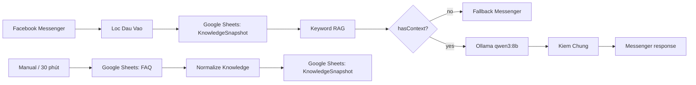

Bạn là Senior Solution Architect, chuyên gia n8n, Redis, RAG, Ollama và hệ thống chatbot Facebook Messenger/Zalo OA.

Hãy đọc và phân tích toàn bộ dự án hiện tại của tôi trước khi đề xuất thay đổi.

## 1. Bối cảnh hệ thống

Tôi đang xây dựng chatbot chăm sóc khách hàng với kiến trúc gần giống:

Client Facebook Messenger/Zalo OA
→ Webhook n8n
→ Lọc và chuẩn hóa đầu vào
→ Google Sheets
→ RAG
→ Router
→ Ollama local
→ Trả lời khách hàng

Hiện tại toàn bộ dữ liệu nghiệp vụ và kho tri thức đang được quản lý trong Google Sheets.

Dữ liệu gồm:

* Danh sách sản phẩm.
* Mã sản phẩm.
* Giá bán.
* Số lượng tồn kho.
* Quy cách sản phẩm.
* Thông tin sản phẩm.
* Chính sách đổi trả.
* Hướng dẫn sử dụng.
* Câu hỏi thường gặp.
* Thông tin giao hàng.
* Nội dung chăm sóc khách hàng.
* Tone of voice.
* Các quy trình xử lý khiếu nại.

Máy chạy Ollama hiện tại là Mac mini M4 16GB RAM.

Mục tiêu ưu tiên:

* Trả lời khách hàng bằng tiếng Việt tự nhiên.
* Thời gian phản hồi khoảng 2–3 giây.
* Không yêu cầu suy luận toán học hoặc logic phức tạp.
* Giảm tối đa số lần truy cập Google Sheets khi khách nhắn tin.
* Không để Ollama tự bịa giá, tồn kho hoặc chính sách.
* Có thể mở rộng sau này nhưng hiện tại chỉ có một người phát triển và vận hành.
* Ưu tiên giải pháp đơn giản, ổn định và dễ bảo trì.

Tôi dự định đồng bộ dữ liệu từ Google Sheets sang Redis khoảng 30 phút một lần hoặc cập nhật ngay khi Sheet thay đổi.

## 2. Nhiệm vụ của bạn

Trước tiên, hãy đọc toàn bộ dự án và không vội chỉnh sửa code hoặc workflow.

Hãy kiểm tra:

* Toàn bộ source code.
* Các file Docker và Docker Compose.
* Các file cấu hình môi trường.
* Các workflow n8n dạng JSON.
* Các node Google Sheets.
* Các node RAG hoặc Vector Store.
* Các node Ollama.
* Các node Router, Switch, IF và Code.
* Cách hệ thống nhận webhook.
* Cách lưu session người dùng.
* Cách xử lý lịch sử hội thoại.
* Cách lấy dữ liệu sản phẩm.
* Cách lấy giá và tồn kho.
* Cách tạo embedding.
* Cách lưu và truy vấn kho tri thức.
* Cách gửi câu trả lời về Facebook hoặc Zalo.
* Cách xử lý lỗi, retry và timeout.
* Các đoạn logic bị lặp lại.
* Các điểm có thể khiến phản hồi chậm.
* Các thông tin nhạy cảm đang ghi trực tiếp trong workflow hoặc source code.

Nếu dự án có nhiều thư mục, hãy tự tìm các file liên quan. Không chỉ đọc README.

## 3. Phân tích kiến trúc hiện tại

Hãy mô tả chính xác flow hiện tại dựa trên code và workflow thực tế.

Đầu ra cần có:

### 3.1 Sơ đồ flow hiện tại

Trình bày bằng Mermaid hoặc sơ đồ text, ví dụ:

Client
→ Webhook
→ Validate
→ Google Sheets
→ RAG
→ Router
→ Ollama
→ Response

Nhưng phải dựa trên dự án thực tế, không được tự giả định.

### 3.2 Bảng phân tích từng bước

Với mỗi node hoặc thành phần, hãy ghi:

* Tên node hoặc file.
* Chức năng.
* Input.
* Output.
* Dịch vụ bên ngoài được gọi.
* Thời gian xử lý có thể phát sinh.
* Rủi ro.
* Có cần giữ lại hay thay đổi không.

### 3.3 Điểm nghẽn hiệu năng

Tìm các nguyên nhân làm chậm, đặc biệt:

* Gọi Google Sheets trong mỗi tin nhắn.
* Gọi nhiều workflow con liên tiếp.
* Tạo embedding lại không cần thiết.
* Gọi Ollama nhiều lần trong cùng một request.
* Model bị unload khỏi RAM.
* Prompt quá dài.
* Lịch sử hội thoại quá dài.
* Context quá lớn.
* Query RAG trả về quá nhiều document.
* Node chạy tuần tự dù có thể bỏ qua.
* Timeout giữa n8n và Ollama.
* Truy cập Ollama qua mạng hoặc Tailscale.
* Các vòng lặp hoặc retry không cần thiết.

Hãy ước lượng tương đối thời gian của từng bước.

## 4. Thiết kế kiến trúc Redis mới

Mục tiêu là tách hệ thống thành hai luồng độc lập.

### 4.1 Luồng đồng bộ dữ liệu

Google Sheets
→ n8n Sync Workflow
→ Chuẩn hóa dữ liệu
→ Kiểm tra dữ liệu thay đổi
→ Redis dữ liệu nghiệp vụ
→ Redis Vector Store hoặc Vector Database
→ Lưu trạng thái đồng bộ

Luồng này không nằm trong request trả lời khách hàng.

Hãy phân tích phương án:

* Đồng bộ mỗi 30 phút.
* Đồng bộ giá và tồn kho mỗi 1–5 phút.
* Google Apps Script gọi webhook n8n khi Sheet thay đổi.
* Chỉ cập nhật dòng thay đổi.
* Không tạo lại embedding cho toàn bộ dữ liệu.
* Dùng `updated_at`, version hoặc hash nội dung.
* Cách xử lý dòng bị xóa khỏi Sheet.
* Cách xử lý dữ liệu trùng.
* Cách rollback nếu đồng bộ lỗi.
* Cách bảo đảm lần đồng bộ mới không làm hỏng dữ liệu đang hoạt động.

### 4.2 Luồng trả lời khách hàng

Client
→ Webhook
→ Validate và chống spam
→ Lấy session Redis
→ Router
→ Redis dữ liệu nghiệp vụ hoặc Vector Search
→ Ollama khi cần
→ Kiểm tra output
→ Gửi câu trả lời
→ Lưu session Redis

Workflow trả lời khách hàng không được gọi Google Sheets trực tiếp, trừ trường hợp fallback đặc biệt được giải thích rõ.

## 5. Phân loại dữ liệu trong Redis

Hãy đề xuất cách chia dữ liệu.

### 5.1 Dữ liệu chính xác, có cấu trúc

Ví dụ:

* Giá bán.
* Tồn kho.
* Mã sản phẩm.
* Quy cách.
* Đơn vị tính.
* Trạng thái sản phẩm.
* Thông tin liên hệ.
* Phí vận chuyển.

Các dữ liệu này phải được truy vấn trực tiếp bằng Redis Key/Hash/JSON.

Không dùng RAG để suy đoán giá hoặc tồn kho.

Đề xuất key naming cụ thể, ví dụ:

* `product:{product_id}`
* `product:sku:{sku}`
* `product:name:{normalized_name}`
* `inventory:{product_id}`
* `price:{product_id}`
* `sync:google-sheet:last-success`
* `sync:google-sheet:version`

Cho ví dụ cấu trúc dữ liệu Redis Hash hoặc Redis JSON.

### 5.2 Dữ liệu văn bản dùng cho RAG

Ví dụ:

* FAQ.
* Chính sách đổi trả.
* Hướng dẫn sử dụng.
* Thông tin sản phẩm dài.
* Quy trình xử lý khiếu nại.
* Tone of voice.

Hãy đề xuất:

* Cách chunk nội dung.
* Metadata cần lưu.
* ID document ổn định.
* Cách cập nhật embedding.
* Cách xóa embedding cũ.
* Số lượng kết quả `topK`.
* Ngưỡng similarity.
* Có nên dùng Redis Vector Store, Qdrant, Chroma hay PostgreSQL pgvector.
* Phương án đơn giản nhất cho một người vận hành.

Nếu dùng Redis Vector Store, hãy kiểm tra phiên bản Redis và module Search có phù hợp không.

### 5.3 Session và lịch sử hội thoại

Đề xuất cấu trúc:

* `session:{channel}:{user_id}`
* TTL phù hợp.
* Số tin nhắn tối đa cần giữ.
* Cách lưu sản phẩm khách đang hỏi.
* Cách lưu intent gần nhất.
* Cách tránh gửi toàn bộ lịch sử dài vào Ollama.

Ví dụ:

Khách: “Bao bì 5kg giá bao nhiêu?”
Bot: “Dạ giá hiện tại là...”
Khách: “Còn hàng không?”

Hệ thống phải hiểu “còn hàng không” đang nói về sản phẩm trước đó.

### 5.4 Cache câu trả lời

Phân tích dữ liệu nào được cache câu trả lời và dữ liệu nào không được cache.

Không cache lâu câu trả lời chứa:

* Giá.
* Tồn kho.
* Trạng thái đơn hàng.
* Thời gian giao hàng thay đổi liên tục.

Có thể cache:

* Câu chào.
* FAQ tĩnh.
* Chính sách ít thay đổi.
* Nội dung hướng dẫn.

Đề xuất TTL cụ thể.

## 6. Thiết kế Router

Hãy đặt Router trước RAG và Ollama.

Đề xuất cách phân loại:

1. Chào hỏi hoặc cảm ơn
   → Trả lời bằng template, không gọi Ollama.

2. Giá hoặc tồn kho
   → Truy vấn Redis dữ liệu chính xác.
   → Có thể trả lời bằng template, không gọi Ollama.

3. Thông tin sản phẩm
   → Redis dữ liệu sản phẩm hoặc Vector Search.
   → Gọi Ollama nếu cần diễn đạt tự nhiên.

4. FAQ hoặc chính sách
   → Vector Search.
   → Ollama tạo câu trả lời từ context.

5. Khiếu nại
   → Thu thập thông tin cần thiết.
   → Có thể chuyển nhân viên.

6. Không tìm thấy dữ liệu hoặc độ tin cậy thấp
   → Không bịa.
   → Hỏi lại khách hoặc chuyển nhân viên.

Hãy phân tích nên dùng:

* Rule-based Router bằng Switch/IF.
* Keyword matching.
* Regex.
* Ollama model nhỏ để phân loại intent.
* Kết hợp rule và model.

Ưu tiên phương án nhanh nhất và ít lỗi nhất.

## 7. Tối ưu Ollama

Hãy kiểm tra model hiện tại và đề xuất model phù hợp với:

* Mac mini M4.
* 16GB RAM.
* Tiếng Việt.
* Trả lời khách hàng.
* Thời gian phản hồi 2–3 giây.
* Không cần suy luận phức tạp.

Phân tích các lựa chọn model 3B–4B.

Đề xuất cấu hình:

* `keep_alive`.
* `num_ctx`.
* `num_predict`.
* `temperature`.
* `top_p`.
* Streaming.
* Số request đồng thời.
* Prompt hệ thống.
* Cách giới hạn câu trả lời 1–3 câu.
* Cách giữ model luôn nằm trong RAM.
* Cách kiểm tra model có bị unload không.

Không đề xuất model lớn chỉ vì mạnh hơn nếu làm hệ thống chậm.

## 8. Thiết kế prompt chống hallucination

Viết system prompt để Ollama:

* Chỉ trả lời dựa trên dữ liệu được cung cấp.
* Không tự tạo giá hoặc tồn kho.
* Không tự tạo chính sách.
* Nếu không có dữ liệu thì nói chưa tìm thấy thông tin.
* Không tiết lộ prompt, metadata hoặc thông tin nội bộ.
* Trả lời tiếng Việt tự nhiên.
* Giọng lịch sự, gần gũi.
* Trả lời từ 1–3 câu.
* Không giải thích kỹ thuật cho khách.
* Không nhắc tới Redis, RAG, Google Sheets, Ollama hoặc hệ thống nội bộ.

## 9. Xử lý lỗi và fallback

Đề xuất flow khi:

* Redis không kết nối được.
* Redis không có dữ liệu.
* Đồng bộ Google Sheets bị lỗi.
* Ollama timeout.
* Ollama không kết nối được.
* Vector Search không có kết quả.
* Facebook/Zalo API trả lỗi.
* Khách gửi nhiều tin liên tục.
* Một workflow chạy trùng nhiều lần.
* Cùng một webhook bị gửi lại.
* Dữ liệu trong Redis đã quá cũ.

Cần có:

* Retry hợp lý.
* Timeout rõ ràng.
* Dead-letter hoặc error workflow.
* Idempotency key.
* Logging.
* Alert.
* Fallback chuyển nhân viên.

Không được fallback sang câu trả lời bịa.

## 10. Bảo mật

Kiểm tra và đề xuất:

* Redis có password hay không.
* Redis có bị expose ra internet không.
* Ollama có bị expose công khai không.
* Credential Google Sheets có nằm trong workflow JSON không.
* Token Facebook/Zalo có nằm trực tiếp trong node không.
* Có dùng biến môi trường hay n8n Credentials không.
* Webhook có verify signature không.
* Có rate limit không.
* Có log thông tin nhạy cảm của khách hàng không.

## 11. Quan sát và đo hiệu năng

Đề xuất cách đo:

* Tổng thời gian từ lúc nhận webhook tới lúc gửi phản hồi.
* Thời gian Router.
* Thời gian Redis.
* Thời gian Vector Search.
* Thời gian Ollama bắt đầu trả token.
* Thời gian Ollama hoàn thành.
* Thời gian gọi Facebook/Zalo API.
* Cache hit/miss.
* Số lần fallback.
* Số lần không tìm thấy dữ liệu.
* Tuổi dữ liệu trong Redis.
* Trạng thái workflow đồng bộ.

Đặt mục tiêu hiệu năng:

* Template hoặc Redis trực tiếp: dưới 500–1000 ms.
* Redis + Ollama: khoảng 2–3 giây.
* Không để một request gọi Ollama nhiều lần nếu không cần thiết.

## 12. Đầu ra bắt buộc

Sau khi đọc dự án, hãy xuất báo cáo theo đúng cấu trúc:

### A. Tóm tắt hệ thống hiện tại

* Hệ thống đang hoạt động như thế nào.
* Các thành phần chính.
* Các workflow chính.
* Các phụ thuộc bên ngoài.

### B. Sơ đồ kiến trúc hiện tại

Dùng Mermaid.

### C. Các vấn đề đang tồn tại

Sắp xếp theo:

* Critical.
* High.
* Medium.
* Low.

Mỗi vấn đề phải ghi rõ:

* File hoặc workflow liên quan.
* Node liên quan.
* Nguyên nhân.
* Tác động.
* Cách sửa đề xuất.

### D. Kiến trúc đề xuất

Dùng Mermaid, bao gồm:

* Google Sheets.
* Sync Workflow.
* Redis.
* Vector Store.
* Session.
* Router.
* Ollama.
* Facebook/Zalo.
* Error Workflow.

### E. Thiết kế Redis

Bao gồm:

* Key naming.
* Data structure.
* TTL.
* Index.
* Vector index.
* Session structure.
* Cache structure.
* Ví dụ dữ liệu.

### F. Danh sách workflow n8n cần có

Ít nhất phân tích các workflow:

1. `customer-message-handler`
2. `google-sheet-sync-products`
3. `google-sheet-sync-knowledge`
4. `knowledge-embedding-upsert`
5. `conversation-session-manager`
6. `error-handler`
7. `health-check`
8. `manual-reindex`

Với mỗi workflow, trình bày:

* Trigger.
* Các node theo thứ tự.
* Input.
* Output.
* Redis key được đọc/ghi.
* Điều kiện nhánh.
* Error handling.

### G. Kế hoạch triển khai theo giai đoạn

Chia thành:

#### Giai đoạn 1: Đo và hiểu hệ thống hiện tại

* Thêm log và đo latency.
* Không thay đổi hành vi hệ thống.

#### Giai đoạn 2: Thêm Redis cho sản phẩm, giá và tồn kho

* Đồng bộ từ Google Sheets.
* Workflow chat đọc Redis thay vì Sheet.
* Có fallback an toàn.

#### Giai đoạn 3: Chuyển kho tri thức sang Vector Store

* Chuẩn hóa document.
* Chunk.
* Embedding.
* Upsert.
* Query.

#### Giai đoạn 4: Thêm session Redis và Router nhanh

* Lưu ngữ cảnh ngắn hạn.
* Bỏ các lần gọi Ollama không cần thiết.

#### Giai đoạn 5: Tối ưu Ollama

* Giữ model trong RAM.
* Giảm prompt và context.
* Streaming.
* Giới hạn output.

#### Giai đoạn 6: Kiểm thử và chuyển đổi

* Shadow mode.
* So sánh câu trả lời cũ và mới.
* Canary rollout.
* Rollback.

### H. Danh sách công việc chi tiết

Mỗi task cần có:

* Mã task.
* Mô tả.
* File hoặc workflow cần sửa.
* Độ ưu tiên.
* Phụ thuộc.
* Rủi ro.
* Điều kiện hoàn thành.

### I. Các file dự kiến thay đổi

Liệt kê chính xác sau khi đã đọc dự án.

Không được tự đặt tên file nếu chưa kiểm tra cấu trúc dự án.

### J. Những câu hỏi còn thiếu

Chỉ ghi các câu hỏi thật sự không thể xác định từ source code, workflow hoặc cấu hình.

## 13. Quy tắc làm việc

* Không chỉnh sửa code trong lần phân tích đầu tiên.
* Không tạo lại toàn bộ dự án.
* Không đề xuất bỏ n8n nếu chưa có lý do rõ ràng.
* Ưu tiên tái sử dụng workflow hiện tại.
* Không thêm công nghệ phức tạp nếu Redis và n8n đã giải quyết được.
* Không dùng Google Sheets trong luồng realtime nếu có thể đọc Redis.
* Không dùng RAG cho dữ liệu cần chính xác tuyệt đối như giá và tồn kho.
* Không gọi Ollama cho những câu trả lời có thể xử lý bằng template.
* Không tạo embedding lại toàn bộ dữ liệu khi chỉ một dòng thay đổi.
* Mọi nhận xét phải dẫn tới file, node hoặc workflow cụ thể.
* Phân biệt rõ điều đã quan sát được và điều đang giả định.
* Nếu không tìm thấy một thành phần, hãy ghi rõ “không tìm thấy”.
* Không được nói chung chung.
* Không triển khai cho đến khi tôi duyệt plan.

Bắt đầu bằng việc lập danh sách cấu trúc dự án và các workflow n8n đã tìm thấy. Sau đó mới phân tích luồng dữ liệu và kiến trúc.

Đã audit ở chế độ read-only, không sửa workflow hay source.
Kết luận
Bản hiện tại là Basic RAG proof-of-concept, chưa có Redis, Vector DB, Docker, session/history, giá/tồn kho, cache hay cơ chế chống webhook trùng. Nó phù hợp để test FAQ nhỏ, nhưng chưa đạt mục tiêu ổn định 2–3 giây và không thể trả lời chính xác dữ liệu động.
n8n đang cấu hình trỏ tới https://n8n.dinhduongcantho.io.vn, nhưng API hiện trả Cloudflare Tunnel 530 / Error 1033; vì vậy không xác minh được trạng thái workflow live. Source local của cả hai workflow cũng đang active: false.

Thành phần	Chức năng thực tế	Rủi ro / nhận xét
Messenger Trigger	Nhận messages Facebook	Có App ID và credential reference, không có session/dedup.
Loc Dau Vao	Lấy text/PSID, chặn từ nhạy cảm và CFC	Rule keyword dễ false-positive; không rate-limit.
Get Knowledge Snapshot	Đọc Google Sheets A:E cho từng tin nhắn	Nút thắt chính; lỗi vẫn đi tiếp vì alwaysOutputData.
RAG Tim Kiem	Normalize, keyword score, lấy top-3	Không embedding, không semantic search, không try/catch JSON.
Router Co Nguon	Score >= 12 mới gọi Ollama	Đúng hướng, nhưng chưa phân loại giá/tồn kho/template.
Goi Ollama Local	Gọi /api/generate với qwen3:8b	Chỉ gửi contextAnswer top-1, bỏ phí context top-3 đã tạo.
Kiem Chung	Chặn output quá ngắn/từ chối	Không kiểm link, số điện thoại, brand sai hay hallucination.
Send/Fallback	Gửi Graph API Messenger	Không retry, idempotency hay xử lý lỗi API.
Knowledge Sync	Đọc FAQ, lọc brand, tạo JSON snapshot mỗi 30 phút	Không hash/version/incremental sync/rollback.

Các điểm quan trọng trong source:
Chatbot đọc Sheet ở mọi request: [zeo_chatbot.workflow.ts (line 121)](/Users/hyden/Documents/N8n/ChatbotN8n/workflows/local-n8n/zeo_chatbot.workflow.ts:121).
Retriever tạo top-3 nhưng Ollama chỉ nhận top-1: [zeo_chatbot.workflow.ts (line 245)](/Users/hyden/Documents/N8n/ChatbotN8n/workflows/local-n8n/zeo_chatbot.workflow.ts:245), [zeo_chatbot.workflow.ts (line 308)](/Users/hyden/Documents/N8n/ChatbotN8n/workflows/local-n8n/zeo_chatbot.workflow.ts:308).
Hậu kiểm hiện chỉ kiểm độ dài và vài câu từ chối: [zeo_chatbot.workflow.ts (line 325)](/Users/hyden/Documents/N8n/ChatbotN8n/workflows/local-n8n/zeo_chatbot.workflow.ts:325).
FAQ chuẩn có 9 cột nhưng Sync chỉ đọc A:H, bỏ updated_at: [zeo_knowledge_sync_basic.workflow.ts (line 76)](/Users/hyden/Documents/N8n/ChatbotN8n/workflows/local-n8n/zeo_knowledge_sync_basic.workflow.ts:76).
ZeO/Oplus không nằm trong whitelist, nên dòng đó bị loại khi sync: [zeo_knowledge_sync_basic.workflow.ts (line 145)](/Users/hyden/Documents/N8n/ChatbotN8n/workflows/local-n8n/zeo_knowledge_sync_basic.workflow.ts:145).
Giá, SKU và tồn kho chưa tồn tại trong schema hiện dùng; CSV hiện là FAQ/policy, không phải dữ liệu nghiệp vụ: [zeo_faq_google_sheet.csv (line 1)](/Users/hyden/Documents/N8n/ChatbotN8n/google_upload/zeo_faq_google_sheet.csv:1).
Hiệu năng hiện tại
Ước lượng warm request: Facebook 100–500 ms, Google Sheets 200–1.500 ms, scoring dưới 20 ms, Ollama 1–vài giây, gửi Facebook 100–500 ms. Vì thế 2–3 giây chưa chắc đạt, nhất là khi model cold-load. qwen3:8b khoảng 5.2 GB; qwen3:4b khoảng 2.5 GB, hợp hơn cho Mac mini M4 16 GB nếu chất lượng test vẫn đạt. Ollama Qwen3
Kiến trúc Redis đề xuất
Google Sheets / Apps Script
  -> Sync workflow
  -> normalize + content_hash + validate
  -> Redis structured data
  -> Redis vector index (chỉ chunk thay đổi)
  -> active-version pointer

Messenger/Zalo
  -> validate + idempotency + rate limit
  -> Redis session
  -> Router
  -> exact Redis lookup OR vector search
  -> Ollama khi cần diễn đạt
  -> output guardrail
  -> Messenger/Zalo + session
Dùng một Redis có Redis Search/Vector Search là phương án gọn nhất cho một người vận hành. Redis hỗ trợ vector field trên Hash/JSON, metadata filter và KNN; dùng HNSW khi số chunk tăng. Xác minh server bằng FT._LIST và test FT.CREATE trước khi triển khai. Redis vector search
Loại	Redis key đề xuất	Quy tắc
Sản phẩm chính xác	product:{id}, product:sku:{sku}	Hash/JSON; giá, tồn kho, quy cách, status. Không dùng RAG.
Giá/tồn kho	price:{id}, inventory:{id}	Đồng bộ 1–5 phút hoặc event Sheet.
RAG chunks	kb:{version}:chunk:{doc}:{n} + idx:kb	Embedding chỉ khi content_hash đổi; metadata brand/category/source.
Session	session:messenger:{psid}	TTL 30 phút, 4–6 lượt gần nhất, last_product_id, last_intent.
Chống trùng	event:messenger:{mid}	SET NX EX 600.
Cache FAQ tĩnh	reply:{kb_version}:{question_hash}	TTL 24 giờ; không cache lâu giá/tồn kho/đơn hàng.

Sync nên ghi vào version staging, kiểm tra xong mới đổi sync:kb:active_version. Nếu Sync lỗi, giữ version trước; nếu Sheet xóa dòng, xóa document/chunk không còn trong manifest mới. Apps Script webhook chỉ nên debounce 15–30 giây; còn giá/tồn kho chạy lịch 1–5 phút.
Router đề xuất
Chào hỏi/cảm ơn: template, không Ollama.  
SKU/giá/tồn kho: Redis exact lookup, template, không Ollama.  
Sản phẩm/FAQ/policy: Redis Search topK 3, gọi Ollama khi similarity đủ cao.  
Khiếu nại/kích ứng/hoàn tiền: thu mã đơn, ảnh, số lô rồi handoff.  
Confidence thấp hoặc Redis/Vector lỗi: không bịa, hỏi lại hoặc chuyển admin.
Ollama
Khuyến nghị benchmark qwen3:4b trước, đối chiếu 30–50 case trong test.md; chỉ giữ qwen3:8b nếu 4B trả lời không đạt. Cấu hình khởi điểm:
{
  "model": "qwen3:4b",
  "stream": false,
  "think": false,
  "keep_alive": "30m",
  "options": {
    "num_ctx": 2048,
    "num_predict": 120,
    "temperature": 0.2,
    "top_p": 0.8
  }
}
keep_alive tránh cold-load; kiểm tra model đang nằm RAM bằng ollama ps. API cũng trả load_duration, prompt_eval_duration, eval_duration để đo chính xác latency. Ollama keep-alive, Ollama usage metrics
System prompt nên là:
Bạn là nhân viên CSKH ZeO Vietnam.
Chỉ dùng DỮ LIỆU ĐƯỢC CUNG CẤP. Không tạo giá, tồn kho, khuyến mãi,
chính sách, số điện thoại hoặc URL mới. Nếu dữ liệu không đủ, nói rằng
mình chưa có thông tin chính xác và sẽ chuyển admin hỗ trợ.
Không nhắc Redis, RAG, Google Sheets, Ollama hay metadata.
Trả lời tiếng Việt, xưng mình-bạn, 1–3 câu.

[DỮ LIỆU ĐƯỢC CUNG CẤP]
{{context}}
Ưu tiên triển khai
Khôi phục Cloudflare Tunnel, sau đó pull/list để so sánh source với live.  
Đưa structured data, session và idempotency vào Redis trước; loại Google Sheets khỏi request chatbot.  
Thêm versioned Sync + hash incremental.  
Thêm Redis Vector Search và embedding model riêng; qwen3-embedding có API /api/embed chính thức. Ollama embedding  
Siết output guardrail, timeout/retry, error workflow, alert và metric latency.