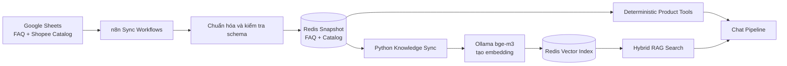
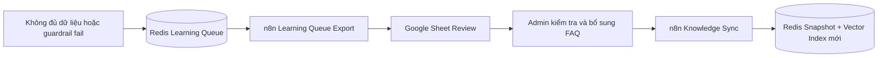

# Sơ Đồ Workflow Chatbot ZeO / CFC Dùng Cho Báo Cáo

Ngày cập nhật: 2026-08-21  
Mục đích: cung cấp sơ đồ đúng với hệ thống hiện hành và prompt có thể sao chép trực tiếp vào ChatGPT/Image Generator để tạo infographic báo cáo.

> Đây là tài liệu mô tả kiến trúc, không phải một workflow n8n mới để deploy. Workflow n8n đang chạy vẫn là `zeo_chatbot.workflow.ts` và `cfc_cobay_chatbot.workflow.ts`.

## 1. Luồng Một Tin Nhắn Từ Khách Đến Khi Bot Trả Lời

```mermaid
flowchart LR
    A[Khách hàng nhắn Messenger] --> B[n8n Facebook Messenger Trigger]
    B --> C[Lọc đầu vào<br/>text, sender_id, message_id]
    C --> D[Python FastAPI<br/>POST /api/chat-pipeline]

    D --> E[Đọc Redis/RAM<br/>profile, session, recent turns]
    E --> F[Hiểu ngữ cảnh<br/>intent, entity, sản phẩm đó, cái số N]

    F --> G{Chọn nhánh xử lý}
    G -->|Câu rõ ràng| H[Deterministic Router & Tools]
    G -->|Wording khó, assist bật| I[Ollama NLU Planner<br/>chỉ trả JSON intent/tool]
    G -->|Cần kiến thức FAQ| J[Hybrid RAG<br/>Lexical + Vector Search]

    I --> H
    H --> K[(Shopee Catalog / Google Sheet / Redis)]
    J --> L[(Redis FAQ Vector Index<br/>embedding bge-m3)]

    K --> M[Grounding & Guardrails<br/>kiểm tra giá, link, tồn kho, brand]
    L --> M
    M --> N[Grounded CSKH Answer<br/>template hoặc Ollama viết lại facts]
    N --> O[ChatPipelineResponse<br/>answer, intent, score, link, trace]
    O --> P[n8n Prepare Messenger Reply]
    P --> Q[Facebook Graph API]
    Q --> R[Khách nhận câu trả lời]

    M -->|Thiếu dữ liệu / confidence thấp| S[Fallback trung thực<br/>Learning Queue / chuyển Admin]
    S --> O
```



Điểm cần giữ đúng khi đưa vào báo cáo:

- n8n là cổng nhận/gửi, không phải bộ não trả lời.
- Python FastAPI là nơi điều phối hội thoại.
- Ollama không tự bịa giá hoặc link; planner chỉ chọn intent/tool dạng JSON.
- RAG là một nhánh có điều kiện, không phải tin nhắn nào cũng chạy qua RAG.
- Giá, link và sản phẩm phải lấy từ catalog/Sheet/Redis rồi qua guardrail.

## 2. Luồng Đồng Bộ Kiến Thức Và Danh Mục



## 3. Luồng Học Từ Câu Chưa Trả Lời Được



## 4. Prompt Tạo Hình Cho Báo Cáo — Bản Khuyến Nghị

Sao chép nguyên khối dưới đây vào ChatGPT tạo hình:

```text
Hãy tạo một infographic kiến trúc hệ thống chatbot doanh nghiệp bằng tiếng Việt, tỷ lệ 16:9, độ phân giải 4K, phong cách flat vector hiện đại, sạch, chuyên nghiệp, nền trắng pha xanh rất nhạt, màu chủ đạo xanh dương và xanh ngọc, chữ tiếng Việt rõ ràng và không sai chính tả.

Tiêu đề: “KIẾN TRÚC CHATBOT ZEO / CFC – HYBRID AGENTIC RAG CÓ KIỂM SOÁT”

Vẽ luồng chính từ trái sang phải:
1. “Khách hàng – Facebook Messenger”
2. “n8n I/O Gateway – Nhận và lọc tin nhắn”
3. “Python FastAPI – /api/chat-pipeline – Bộ não điều phối”
4. Bên trong Python chia thành các khối:
   - “Conversation Memory – Redis/RAM”
   - “Context & Reference Resolution”
   - “Deterministic Router & Product Tools”
   - “Ollama NLU Planner – JSON intent/tool, tùy chọn”
   - “Hybrid RAG – Lexical + Vector Search”
   - “Grounding & Guardrails – Không bịa giá/link/tồn kho”
5. Hai nguồn dữ liệu nối vào Python:
   - “Google Sheets / Shopee Catalog” qua “n8n Sync” vào “Redis Snapshot”
   - “Ollama bge-m3 Embedding” vào “Redis Vector Index”
6. Sau xử lý: “Grounded CSKH Answer” -> “n8n Prepare Reply” -> “Facebook Graph API” -> “Khách nhận câu trả lời”
7. Một nhánh cảnh báo màu cam: “Thiếu dữ liệu / confidence thấp” -> “Fallback trung thực” -> “Learning Queue” -> “Admin duyệt” -> “Đồng bộ lại kiến thức”

Dùng icon phù hợp cho Messenger, n8n automation, Python API, Redis database, Ollama AI, Google Sheets, shield guardrail và khách hàng. Dùng mũi tên rõ ràng. Làm nổi bật thông điệp: “Ollama chỉ hỗ trợ hiểu ý định và diễn đạt; dữ liệu thật đến từ Sheet/Catalog/Redis”. Không vẽ AWS, OpenAI cloud hoặc hệ thống không được nêu. Không đặt API key, token, mật khẩu hoặc thông tin bí mật trong hình.
```

## 5. Prompt Ngắn Cho Hình Một Dòng

```text
Tạo infographic 16:9 tiếng Việt, phong cách flat vector chuyên nghiệp: Khách nhắn Messenger -> n8n nhận/lọc tin -> Python FastAPI chat pipeline -> đọc Redis memory -> chọn Deterministic Tools / Ollama NLU JSON / Hybrid RAG -> Grounding & Guardrails -> n8n gửi qua Facebook Graph API -> khách nhận trả lời. Thêm data flow Google Sheets -> n8n Sync -> Redis Snapshot -> Ollama bge-m3 -> Redis Vector Index. Nhấn mạnh “không bịa giá, link, tồn kho”. Màu xanh dương, xanh ngọc, nền sáng, chữ rõ, không sai chính tả, 4K.
```

## 6. Checklist Duyệt Hình Trước Khi Đưa Vào Báo Cáo

- Có đủ chiều đi và chiều trả lời Messenger.
- Python FastAPI nằm giữa n8n và các nhánh xử lý.
- RAG không bị vẽ thành bước bắt buộc cho mọi câu hỏi.
- Ollama NLU nối sang deterministic tools, không nối thẳng tới giá/link tự sinh.
- Redis thể hiện cả session memory, FAQ snapshot, catalog và vector index.
- Có guardrail/fallback/learning queue.
- Không có credential, URL nội bộ nhạy cảm hoặc số liệu chưa kiểm chứng.
